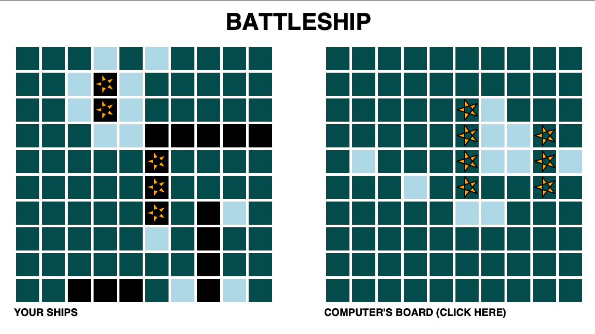

**PROGRAM**: 
This program emulates the game Battleship.

**HOW THE GAME WORKS:** 
The player chooses a square on the board to the right to guess where the computer's 
ships are located. After the player's turn, the computer will guess the player's ships. 
The player and the computer will keep switching turns until all battleships are sunk.

**HOW TO START THE GAME:** Execute the battleship_driver.py file

